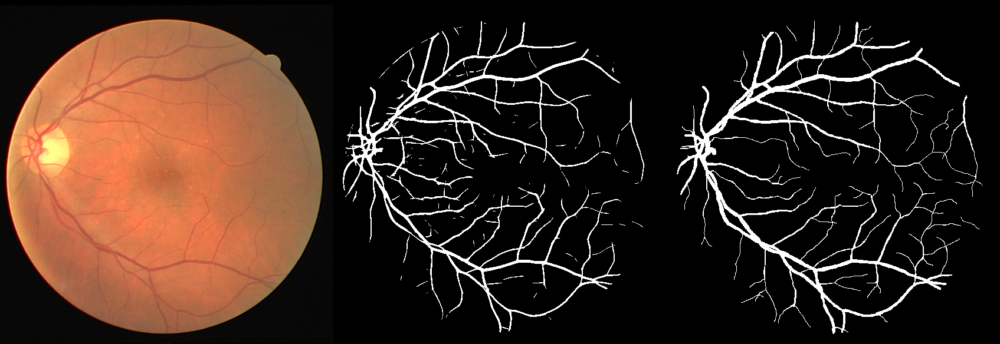

# A Basic Retinal Vessel Segmentation

A simple image processing method for segmentation of blood vessels in retinal images. The algorithm is in file ExtractVessels.m which is tested using the code in ExtractVesselsTest.m.

This method was tested using the test set of the DRIVE database and the results are:

Accuracy = 0.94, Sensitivity = 0.73, Specificity = 0.97

A sample output is shown below. The leftmost image is the input from the DRIVE database, the middle image is the algorithm output, and the rightmost image is a manual segmentation (ground truth)

